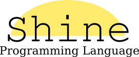

 Shine is an expressive, minimalistic, statically typed programming language implemented in C++.
 With influences derived from languages such as Rust, Ruby, Lua, and C.

## Goals

  - fast
  - simple, explicit, elegant
  - small learning curve (like C)
  - statically typed with inference
  - access to AST from code (static reflections)
  - possibility of shooting in the knees

## Build

 To build Shine, you need next dependencies:
 
    C++ compiler with support C++17
    LLVM and LLVM-dev
    TCLAP
    CMake
    
 After installing all dependencies, simple run:
 
    $ mkdir build
    $ cd build
    $ cmake ..
    $ make -j4

 Check out the help:

    $ ./shine --help

## Status

  This project is a ~~trolling Rust & C~~ toy language. 